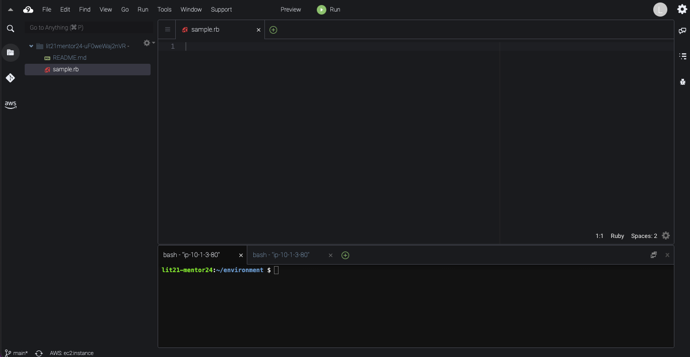

author: Life_is_Tech!\_Web サービスプログラミングコース
summary: Ruby 基礎
id: ruby-basic
categories: ruby
environments: Web
status: Published
feedback link: <https://github.com/la-webs/codelabs>

# Ruby 基礎

## はじめに

このコードラボでは、実際に Cloud9 を使用しながら Ruby について学んでいきます。

Cloud9 で実際にコードを入力して手を動かしながら、進めていきましょう！

### 実行環境を整える

まずは、Cloud9 を開き、`enviroment`のフォルダの直下に、`sample.rb`という名前のファイルを作成しましょう。

ファイルは、左側のフォルダを右クリックして出てくる New File をクリックするか、左上の`file`をクリックして出てくる New File をクリックすると作成できます。

下の写真のようになっていれば OK です。



### コメント

この Codelab を見ていくと、このようなコードがあります。

```ruby
# これは、コメントです。メモなど好きなことを書くことができます。
```

コメントは人間がわかりやすいように複雑な処理や一見わかりにくい処理に対して書くメモ書きです。
`#` シャープを書くことで右側はすべてコメントになります。

## Ruby を実行する

`sample.rb`に下のコードを書いてみましょう。

```ruby
puts "hello world"
```

### Ruby ファイルの実行

下のコマンドでファイルを実行しましょう。Ruby ファイルは、`ruby ファイル名`で実行することができます。

```sh
ruby sample.rb
```

下のようにコンソールに出力されたら OK です。

```sh
hello world
```

### 標準出力

標準出力は、コンソールに情報を表示することができます。

文字列（変数を使わない場合）をコンソールに出力したい場合

```ruby
puts "hoge"
```

```sh
hoge
```

変数の内容をコンソールに出力したい場合

```ruby
hoge = "hello"
puts hoge
```

```sh
hello
```

### チャレンジ

変数を使う場合と使わない場合の 2 つのパターンで実際にコードを書いて出力させましょう。

```sh
Cloud9を使って開発するよ
```

## 変数を知る

次に、変数について詳しく学んでいきましょう。

まず変数とは、データに名前をつけて区別できるようにする仕組みで、Ruby では以下のように定義します。また、Ruby は動的型付け言語なので、型宣言は不要です。

```ruby
キーワード = 初期値
```

### 変数の定義

```ruby
instructor = "kaikai"
puts instructor
```

下のように出力されるか確認してみましょう。

```sh
kaikai
```

### Tips 動的型付けと静的型付け

Ruby は動的型付け言語なので型宣言は不要だと説明しました。動的型付け言語に対して、静的型付け言語も存在します。

iOS アプリ開発でよく用いられる Swift の言語は静的型付け言語です。Swift では変数の定義を次のように行います。

```swift
var instructor : String = "kaikai"
```

このように、静的型付け言語では変数の定義ごとに型を指定する必要があります。

## 型: 文字列を知る

ここでは、文字列について学んでいきます。

Ruby の文字列では、`""`（ダブルクォート）と`''`（シングルウォート）のどちらでも文字列を宣言することができ、`+`演算子で文字列を結合することができます。

```ruby
instructor = 'kaikai'
puts 'hello ' + instructor + '!'
```

```sh
hello kaikai!
```

`""`（ダブルクォート）では、文字列の内部で式展開を行うことができます。

```ruby
instructor = 'kaikai'
puts "hello #{instructor}!"
```

```sh
hello kaikai!
```

## 型: 数値を知る

ここでは、数値について学んでいきます。

Ruby では、数値を数のみを扱える`整数(integer)`か小数点も扱える`浮動小数点数(Float)`のどちらかで数値を扱っていきます。

### 整数(integer)

正の整数・負の整数・ゼロを表すことができます。

```ruby
number1 = 10 # 正の整数
number2 = -10 # 負の整数
number3 = 0 # ゼロ

p number1
p number2
p number3
```

```sh
10
-10
0
```

### 浮動小数点数(Float)

正の浮動小数点数・負の浮動小数点数・ゼロを表すことができます。

```ruby
number1 = 12.3 # 正の浮動小数点数
number2 = -12.3 # 負の浮動小数点数
number3 = 0.0 # ゼロ

p number1
p number2
p number3
```

```sh
12.3
-12.3
0.0
```

### 演算

数値同士では、`+`を用いて演算を行うことができます。

```ruby
puts 10 + 20
```

```sh
30
```

もし、一方が小数だと自動で浮動小数点数(Float)に型変換が行われ、演算が行われます。

```ruby
number = 10 + 10.1
puts number
puts number.integer?
```

```sh
20.1
false
```

※`integer?`は、数値が整数(integer)かを調べるメソッドで、値が浮動小数点数ならば`false`と返します。

### 便利なメソッド

Ruby では、数値用に便利なメソッドが用意されています。ここでは、一例を紹介しますが、他にもあるので自分で調べてみましょう。

```ruby
# 小数点以下を四捨五入
puts 3.14.round
# -> 3
puts 3.34.round
# -> 4

# 小数点以下を切り上げ
puts 3.14.ceil
# -> 4
puts -3.14.ceil
# -3

# 小数点以下を切り捨て
puts 3.14.floor
# -> 3
puts -3.14.floor
# -> -4
```

## 型: 配列を知る

ここでは、配列について学んでいきます。

まず、Ruby では以下のように宣言を行います。

```ruby
animals = ["dog", "cat", "mouse"]
```

上の配列では、3 つの要素をもっています。「dog」「cat」「mouse」の 3 つの文字列オブジェクトを管理しています。
複数の要素から 1 つを特定できるように先頭から順番に番号が割り当てられています。この番号のことを`インデックス`と呼んでいます。先頭から「0」「1」「2」と`0から順`に割り当てられています。

特定の要素を取り出すには、以下の書き方を使用します。

```ruby
配列オブジェクト[インデックス]
```

例えば、「cat」を取り出したい場合は以下のように書くことができます。

```ruby
animals = ["dog", "cat", "mouse"]
puts animals[1]
```

```sh
cat
```

### 要素の追加

要素の追加は、`push`もしくは`<<`を使用して実行することができます。

```ruby
animals = ["dog", "cat", "mouse"]
animals.push("rabbit")
puts animals
```

```ruby
animals = ["dog", "cat", "mouse"]
animals << "rabbit"
puts animals
```

```sh
["dog", "cat", "mouse", "rabbit"]
```

## 型: ハッシュを知る

ここでは、ハッシュについて学んでいきます。

ハッシュは、任意の種類のオブジェクト（キー）から任意の種類のオブジェクト（値）への関連付けを行うことができます。

キーには`:文字列`の形をした シンボル と呼ばれるものを用いるのが一般的です。

ハッシュは以下の方法で書くことができます。

```ruby
{ キー => 値 }
{ キー: 値 }
{ :キー => 値 }
{ "キー": 値 }
{ :"キー" => 値 }
```

例えば、green というキーに「緑」という値・red というキーに「赤」という値を関連づけを行う場合、以下のように書くことができます。

```ruby
{ green: "緑", red: "赤" }
```

### 値の取り出し

キーがシンボルであるとき、`ハッシュ名[:キー]`で取り出すことができます。

```ruby
colors = { green: "緑", red: "赤" }
puts colors[:green]
```

```sh
緑
```

また、存在しないキーを指定すると nil が帰ってきます。

```ruby
colors = { green: "緑", red: "赤"}
puts colors[:blue]
```

```sh
nil
```

### 追加

追加は、以下のような書くことができます。

```ruby
ハッシュ名[:キー] = 値
```

以下の例では、青を追加しています。

```ruby
colors = { green: "緑", red: "赤"}

colors[:blue] = "青"
puts colors
```

```sh
{ green: "緑", red: "赤", blue: "青" }
```

### 削除

削除は、以下のような書くことができます。

```ruby
ハッシュ名.delete(:キー)
```

以下の例では、赤を削除しています。

```ruby
colors = { green: "緑", red: "赤"}

colors.delete(:red)
puts colors
```

```sh
{ green: "緑", blue: "青" }
```

## 型変換を知る

ここでは、型変換について学んでいきます。

まずは、`sample.rb`に以下のコードを入力してみましょう。

```ruby
number = 10
text = "Hello"

puts number + text # TypeError
```

このコードでは、Int 型である`number`と`text`という String 型の情報を足そうとしているため TypeError になります。
しかし、Ruby では、`.to_s`というメソッドを使用してあげることで、Int 型の変数を String 型に変換することができるので、TypeError を回避することができます。

```ruby
number = 10
text = "Hello"

puts number.to_s + text # TypeErrorを回避
```

```sh
10Hello
```

### 型変換のメソッド

ここでは、一例を紹介しますが、他にもあるので自分で調べてみましょう。

```ruby
# 文字列から整数に型変換（数値に変換できない場合、0となる）
"string".to_i

# 文字列から小数に型変換（数値に変換できない場合、0となる）
"string".to_f

# 整数から小数に型変換
10.to_f

# 数値から文字列に型変換
10.to_s
```

### チャレンジ

それでは、以下のコードを実行して TypeError を発生させてみましょう。

```ruby
number1 = 10
number2 = 3.14
text1 = "20"
text2 = "Hello World"

puts number1 + text1
puts number1 + text2
puts number2 + text1
```

続いて、上で定義した変数を用いて、以下の出力になるように自分でプログラムを変えてみましょう。

```sh
30
10Hello World
23.14
```

## 繰り返し処理を知る

ここでは、繰り返し処理について学んでいきます。

### for ループ

Ruby における For ループは、以下のフォーマットで使用します。

```ruby
for 変数 in オブジェクト do
  実行する処理1
  実行する処理2
end
```

オブジェクトには、配列やレンジなどを指定することができます。
レンジとは、数値や文字列の範囲を示すことができるものです。

- `1..5` 1 以上 5 以下
- `1...5` 1 以上 5 未満

という形で使用することができます。

例えば、1 から 4 までの数字を出力するプログラムを以下のように書くことができます。

```ruby
for i in 1..4 do
  puts i
end
```

```sh
1
2
3
4
```

### each ループ

Ruby における each ループは、以下のフォーマットで使用します。

```ruby
オブジェクト.each do |変数|
  実行する処理1
  実行する処理2
end
```

例えば、配列の中身を取り出すプログラムでは以下のようになります。

```ruby
animals = ["dog", "cat", "mouse"]

animals.each do |animal|
  puts animal
end
```

```sh
dog
cat
mouse
```

### while ループ

Ruby における while ループは、以下のフォーマットで使用します。

```ruby
while 条件式 do
  実行する処理1
  実行する処理2
end
```

例えば、1 から 4 までの数字を出力するプログラムを以下のように書くことができます。

```ruby
x = 1

while x <= 4 do
  puts x
  x = x + 1
end
```

```sh
1
2
3
4
```

### チャレンジ

for・each・while のそれぞれを使って、配列の中身を順番に取り出すプログラムを書いてみましょう！

```ruby
# 配列のサンプル
animals = ["dog", "cat", "mouse"]
```

また、「 1 から 100 までの整数の和」を繰り返し処理を用いて求めてみましょう。

次のような結果が出力されたら正解です。

```sh
5050
```

## 条件分岐を知る

ここでは、条件分岐について学んでいきます。

### if を用いた条件式

Ruby では、`if`を以下のように記述します。

```ruby
if 条件式
  条件式がtrueの時の処理
else
  条件式がfalseの時の処理
end
```

また if は、連続して使用することができるので、以下のコードを実行すると

```ruby
x = 4

if x == 0
  puts "zero"
elsif x % 2 == 0
  puts "even"
else
  puts "odd"
end
```

このようになります。

```sh
even
```

### unless を用いた条件式

Ruby では、`unless`を以下のように記述します。

```ruby
unless 条件式
  条件式が偽の時に実行する処理
else
  条件式が真の時に実行する処理
end
```

`elsif`は、unless 文にはありません。そのため、elsif を使用したい場合は`if`文を使用しましょう。

```ruby
x = 4

unless x == 0
  puts "non zero"
else
  puts "zero"
end
```

```sh
non zero
```

## クラスとインスタンスを知る

ここでは、クラスとインスタンスについて学んでいきます。

クラスは、`変数とメソッドが入る設計図`のようなものです。インスタンスは、クラスを元に作成された`実体`です。

例えば、`コース`というクラスを作成した場合、`Webサービスプログラミングコース`や`Webデザインコース`というインスタンスを作成することができます。

### クラスの定義

クラスの内部には、`変数`と`メソッド`を定義することができます。

例えば、コースというクラスの場合、以下のように設計することができます。

```markdown
# Class Course

変数

- name(コース名)
- tool（使用ツール）

メソッド

- application（コースへの申し込み）
- teach（コースを教えることができる）
```

これを定義するには、Ruby では以下のように記述します。

```ruby
class Course
  def initialize(name, tool)
    @name = name
    @tool = tool
  end

  def application(student)
    # コースへの申し込みの処理
  end

  def teach(mentor)
    # 教えることができる人の処理
  end
end
```

ここで、`@name`は生成されたインスタンスに定義される`インスタンス変数`と呼ばれるものです。

`インスタンス変数`の定義には、変数名の最初に`@`を付けます。

### インスタンスの生成

インスタンスを生成するときは、`クラス名.new()`で`initializeメソッド`を呼び出します。この時に、引数に定義した name と tool をインスタンスに定義することができます。

例えば、name に`Webサービスプログラミングコース`・tool に`Cloud9`を定義したい時は以下のように記述します。

```ruby
webs = Course.new("Webサービスプログラミングコース", "Cloud9")
```

### 変数を使う

インスタンスに定義された変数は、`インスタンス名.変数`で取り出すことができます。

例えば、webs というインスタンスの name を取り出したい場合は、以下のように記述します。

```ruby
puts webs.name
```

```sh
Webサービスプログラミングコース
```

### メソッドを使う

インスタンスに定義されたメソッドは、変数と同様に`インスタンス.メソッド名(引数)`で実行することができます。

例えば、application の中身も定義して実行してみましょう。

```ruby
class Course
  略
  def application(student)
    puts "#{student}は#{@name}に申し込みました"
  end
  略
end

webs = Course.new("Webサービスプログラミングコース", "Cloud9")
puts webs.application("がっしー")
```

```sh
がっしーはWebサービスプログラミングコースに申し込みました
```

### チャレンジ

上と同様に Course クラスを作成し、iPhone コースの例を作ってみましょう。出力が以下になるようにコードを書いてみましょう。

```sh
# コース名の出力
iPhoneアプリプログラミングコース

# ツール名の出力
Xcode

# applicationメソッドの実行結果
ビルソンはiPhoneアプリプログラミングコースに申し込みました。

# teachメソッドの実行結果
がっしーはiPhoneアプリプログラミングコースを教えることができます。
```

## Ruby の命名規則

ここでは、Ruby の命名規則について学んでいきます。

|            | 命名規則             | 例          |
| ---------- | -------------------- | ----------- |
| クラス     | UpperCamelCase       | WebService  |
| モジュール | UpperCamelCase       | WebService  |
| メソッド   | snake_case           | web_service |
| 変数       | snake_case           | web_service |
| 定数       | SNAKE_WITH_UPPERCASE | WEB_SERVICE |

## まとめ: Ruby は、究極のオブジェクト指向だ

Ruby は、すべてが`オブジェクト`です。そのため、Ruby は究極のオブジェクト指向な言語です！

例えば、String クラスのインスタンスの場合は以下のような仕組みになっています。

```ruby
# Stringクラスのインスタンス
instructor = 'chanrika'

# Stringクラスのメソッドが使える -> 戻り値はTrueクラスのインスタンス
puts instructor.include?('a')

# Stringクラスのメソッドが使える -> 戻り値はIntegerクラスのインスタンス
puts instructor.to_i
```

```sh
true
0
```

同様に、Array クラスのメソッドは以下のような仕組みになっています。

```ruby
# Arrayクラスのインスタンス
animals = ["dog", "cat", "mouse"]

# Arrayクラスのメソッドが使える
animals.each do |animal|
  # 戻り値はStringクラスのインスタンス
  puts animal
end
```

```sh
dog
cat
mouse
```

## Challenge: じゃんけんアプリを作ろう

標準入力と標準出力を使用して、じゃんけんアプリをつくりましょう。

### 仕様

#### 出せる手

| 出せる手 | 入力・出力上での表現 |
| -- | -- |
| グー | 0 |
| チョキ | 1 |
| パー | 2 |

#### 流れ

1. プレイヤーがじゃんけんの手を選び、標準入力で入力する。（0~2の整数）
2. プレイヤーの手をコンピューターが受け取ったら、ランダムに手を選ぶ。
3. プレイヤーとコンピューターで勝負する
4. 勝負結果・プレイヤーの手・コンピューターの手を、標準出力で表示する。
    - 勝負結果（0がプレイヤーの勝ち、1がプレイヤーの負け、2があいこ）・プレイヤーの手（0~2の整数）・コンピューターの手（0~2の整数）をそれぞれ半角スペースを空けて出力する。

#### 入力と出力の例

例1: プレイヤーが**グー**を選び、コンピューターがランダムで**チョキ**を選んだことで、プレイヤーが**勝った**場合

```sh
## 入力
0

## 出力
0 0 1
```

例2: プレイヤーが**チョキ**を選び、コンピューターがランダムで**グー**を選んだことで、プレイヤーが**負けた**場合

```sh
## 入力
1

## 出力
1 1 0
```

## Challenge: あっち向いてホイアプリを作ろう

前の Challenge で作ったじゃんけんアプリを改良して、あっち向いてホイアプリをつくりましょう。

### 仕様

じゃんけん部分は、上の「Challenge: じゃんけんアプリを作ろう」の章を見てください。

あっち向いてホイは、以下の入力と出力を行います。

1. じゃんけん（「Challenge: じゃんけんアプリを作ろう」と同じです）

   - **ユーザーからの入力**

     - ユーザーの手

   - **出力**
     - 勝敗
     - コンピューター側の手

2. あっち向いてホイ

   - **ユーザーからの入力**

     - どの方向を向くのか or 当てるのか（↑↓←→ の 4 方向）

   - **出力**
     - 勝敗
     - どの方向を向いたか or 当てるのか（↑↓←→ の 4 方向）

## 発展: オブジェクト指向

発展として、13 課で扱った`オブジェクト指向`について詳しく掘り下げます。

`オブジェクト指向(OOP)`とは、あらゆる対象をオブジェクトとして扱い、そのオブジェクト間の相互作用として全体を構成させる、プログラミング手法の一つです。

13 課で学んだように、`Ruby`には`クラス`と`インスタンス`があり、そこには`変数`と`メソッド`が定義されます。

ここでは、クラスとインスタンスには一見関係なさそうな、変数に文字列を代入する例を見てみましょう。

```ruby
text = "hoge"
puts text.class
```

```sh
String
```

`.class`とは、インスタンスのクラスを返す`メソッド`を表します。

結果は`String`と出たように、変数`text`は`Stringクラス`に属する`インスタンス`であることがわかります。

したがって、`Stringクラス`では`メソッド`である`.class`が使えることがわかります。

このように、`Ruby`を始めとする`オブジェクト指向型言語`では、あらゆる対象を`メソッド`と`定義`が用意されたモノ、すなわち`オブジェクト`として扱い、その組み合わせによってプログラムを構成する手法を取ります。

※ 実際には、`.classメソッド`は`Objectクラス`に定義されており、String クラス は Object クラス を`継承`しています。
